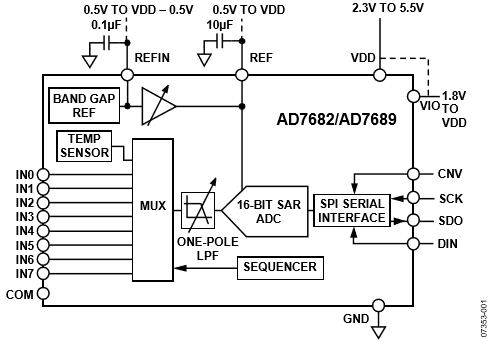
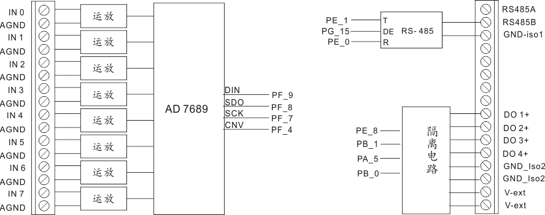

# M2-AD7689-10V 模块
M2-AD7689-10V 是一块基于Analog device 的ADC 芯片AD7689 芯片为主的16位模拟输入板，模拟接口位正负10V标准电压输入。
# 关于AD7689芯片
AD7689是analog device 公司的16位无失真SAR结构ADC 芯片。 
## 内部结构图

## 特性
16 位分辨率
8路多路复用器
内部可选择 2.5V 或者4.096V 参考电压
兼容SPI 接口
20 pin 4 mm × 4 mm LFCSP封装
## 内置温度传感器
AD7689 的配置非常简单，只有一个内部配置寄存器，14位长度。

# M2-AD7689-10V 模块
## 接线图

## 说明
+ 模拟输入采取单端输入模式，电压范围 -10V 到 +10 V。 AGND为公共模拟地。 
+ 板上带有一个RS485 接口，和4路晶体管隔离数字输出电路。  
+ 数字输出电路需要外接电源（24V）。从V-ext 和GND-iso2接入。
## 使用案例
请参考：
参见AD7689Test 项目。 
