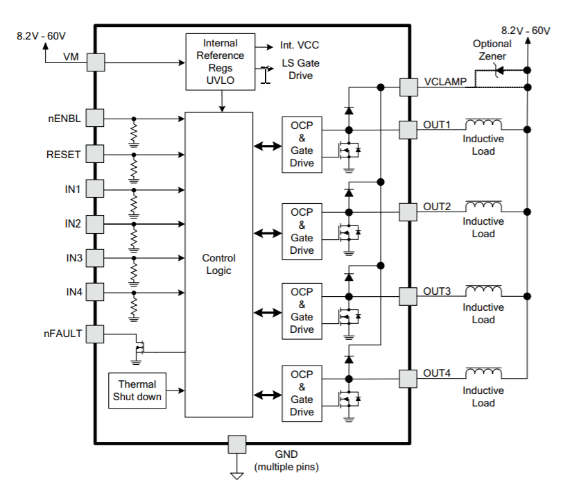

# M2-DIO8-DRV8803 单端数字IO驱动模块
该模块实现8路光电隔离单端数字输入。 单端 NMOS 数字输出。
## 主要技术指标
## 内部接线图

# DRV 8803 芯片
DRV 是TI 公司4路低端驱动器，具有过流保护。所谓低端驱动，就是外接驱动电源-->负载-->DRV8803 输出端。
## 特点
+ 4 通道保护低端驱动器
+ NMOS FET 驱动
+ 单通道 1.5A ，四通道全部开启 800=mA
+ 8.2V 到 60-V 操作电压（V-ext）
## 内部功能图
 
## 应用
+ 继电器驱动
+ 单极性步进电机驱动
+ 超声波驱动
+ 通用低端开关应用
# M2-RS485X4-DRV8803 应用
- 4路RS485 可以实现MODBUS，DMX512 协议。
- 2 片 DRV8803 可以实现
    - 2个步进电机
    - 8 路继电器
- 1路数字信号，可连接hall 传感器，按键开关等。
