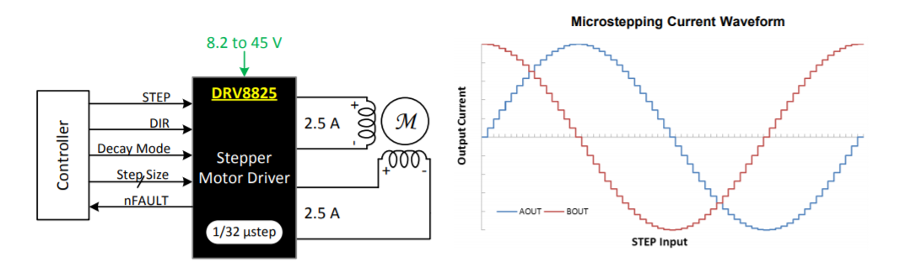

# M2-DRV8825-2
M2-DRV8825-2 IO扩展板上具有2个DRV8825 驱动芯片，2路数字输入和2 路数字输出，1 路 RS-485.
## DRV8825芯片
&nbsp;&nbsp;&nbsp;&nbsp;DRV8825芯片是TI 公司的步进电机驱动电路。支持2 相4线双向步进电机的驱动，具有32微步细分。也可以驱动两个直流有刷电机.
## 特点

+ 内置微步细分电路
+ 24V 时最大电流2.5A
+ 电压范围 8.2-V to 45-V
+ 简单的Step/Dir 接口
+ 低电流睡眠模式
+ 内置 3.3V 参考电压
+ 各种保护电路
## DRV8825内部结构图

## 步进电机的细分
&nbsp;&nbsp;&nbsp;&nbsp;步进电机的细分控制是由驱动器精确控制步进电机的相电流来实现的，以二相电机为例，假如电机的额定相电流为3A，如果使用常规驱动器（如常用的恒流斩波方式）驱动该电机，电机每运行一步，其绕组内的 电流将从0突变为3A或从3A突变到0，相电流的巨大变化，必然会引起电机运行的振动和噪音。如果使用细分驱动器，在10细分的状态下驱动该电机，电机每运行一微步，其绕组内的电流变化只有0.3A而不是3A，且电流是以正弦曲线规律变化，这样就大大的改善了电机的振动和噪音，因此，在性能上的优点才是细分的真正优点。 

细分的优点
---
+ 电机运转更加平滑。
+ 力矩增加了。
+ 解决了电机工作再低频时的噪音问题。

DRV8825 类
----
构造函数 
+ drv8825(pinName dir,PinName step,PinName M0,PinName M1,PinName M2,PinName Enable,PinName Reset,PinName Sleep,PinName Fault)   
成员函数 
+ setMicrostep(int mode)
+ step(float angle,int speed)
+ stop()
+ attach(void (*function)(void))

