# DAPLink使用手册
DAPLink是ARM官方提供的调试器，以前叫CMSIS DAP，现在正式使用DAPLink这个名称。 软硬件均[开源](https://github.com/maximlab/DAPLink)。
# 功能
## DAPLink 提供4个接口
这些接口都是通过一个USB口连接，USB在电脑上生成4个设备：
* MSC - drag-n-drop programming flash memory（mass storge disk/文件夹）
* CDC - virtual com port for log, trace and terminal emulation（串口）
* HID - CMSIS-DAP compliant debug channel（调试）
* WEBUSB HID - CMSIS-DAP compliant debug channel（调试）
## drag-n-drop programming（下载目标文件）
Moduar2连接到PC电脑后，在电脑上可以看到一个可移动磁盘驱动器(MODULAR2)，即daplink驱动器。通过将支持格式的文件（Raw binary file/Intel Hex）复制或保存到daplink驱动器来为目标微控制器编程。完成后, 驱动器将重新安装。如果发生故障, 则文件FAIL.TXT将包含故障信息出现在驱动器上。
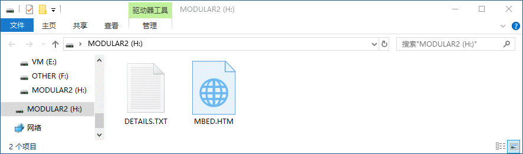
 DETAILS.TXT是MSD配置，默认内容类似如下：
```
# DAPLink Firmware - see https://mbed.com/daplink
Unique ID: 07960000066eff535250897767125932a5a5a5a597969908
HIC ID: 97969908
Auto Reset: 1
Automation allowed: 0
Overflow detection: 1
Daplink Mode: Interface
Interface Version: 0251
Bootloader Version: 0251
Git SHA: 128482cf22f8aeb68368fb9efe8a525bec0144bb
Local Mods: 1
USB Interfaces: MSD, CDC, HID, WebUSB
Bootloader CRC: 0x8f4429f7
Interface CRC: 0x88184ed7
Remount count: 0
``` 
## MSD命令
参考说明：[MSD_COMMANDS.md](https://github.com/maximlab/DAPLink/blob/master/docs/MSD_COMMANDS.md)
通过MSD接口对DAPLink传递一些指定的简单命令。只要拷贝一个指定文件名的文件到MSD内，重启后就可以进行一些操作或配置。在拷贝指令文件时，需要按住复位键。.act文件触发一个动作，.cfg则是一个配置，指令或配置才生效。这些命令仅供参考，实用性不强。
## serial port(串口)
DAPLink通过USB CDC方式虚拟出一个串口，可以直接连接到目标微控制器, 允许双向通信。它还允许通过串行端口发送中断命令来重置目标。
### 驱动安装
WIN10自带驱动，WIN7系统需要安装串口驱动[mbedWinSerial_16466.exe](http://os.mbed.com/media/downloads/drivers/mbedWinSerial_16466.exe) 
### 使用
跟其他USB转串口使用方法类似，[示例程序](https://github.com/maximlab/modular2-lab/blob/master/Lab01_HelloWorld.md)。
### 注意事项
CDC串口不能直接对目标芯片进行ISP，XP系统不支持CDC
## debugging support(调试)
在支持CMSIS-DAP协议的IDE上均可使用DAPLink调试目标芯片，功能类似JLINK、STLINK。
常用能够调试的工具包括:
* [pyOCD](https://github.com/mbedmicro/pyOCD)
* [uVision](http://www.keil.com)
* [IAR](https://www.iar.com)
### MDK设置
点击红框内的魔术棒按钮，进入项目Option。 
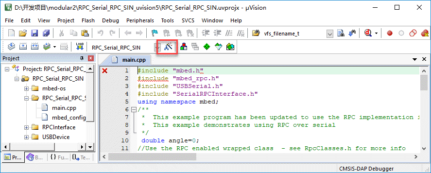
选择Debug标签页，在仿真器下拉菜单中使用CMSIS-DAP Debugger，然后点击Settings进入调试器设置
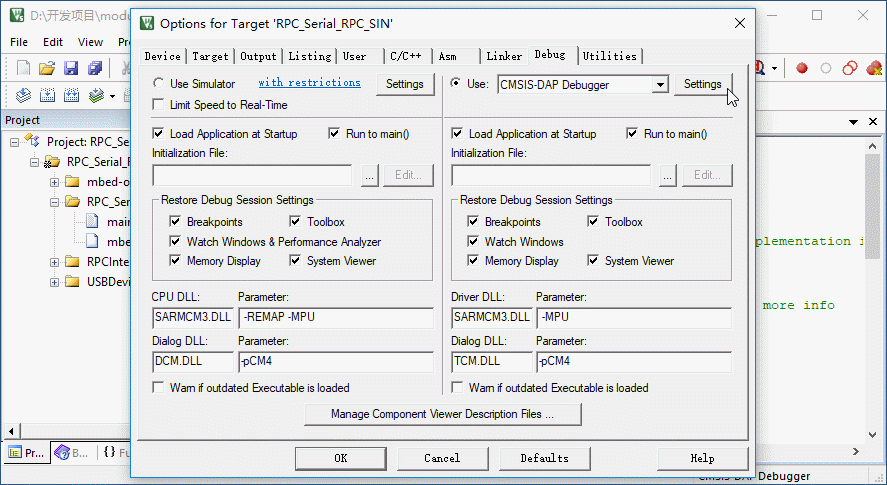
进入调试器设置后，在Debug标签页, 选择CMSIS-DAP，Port选择框选择SW。Max Clock可以设置为高的10MHz（推荐使用优质杜邦线连接，长度小于40CM）。
若接线没有问题，在右边SW Device框内即可以读到IDCODE跟Device Name。若读不到，并且左边的SWJ不是灰色，且没有勾上，请勾选。
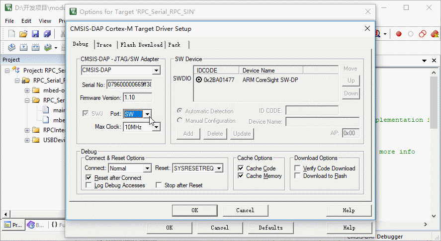
点击Flash Download标签页，在Download Function中进行下载配置。 在下部空白框内可以看到芯片信息，勾上Reset and Run。
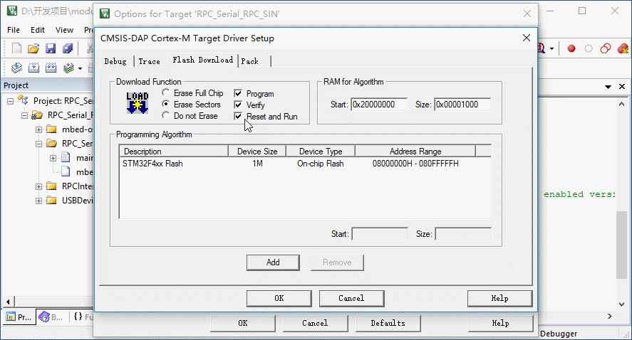 
配置成功后，在MDK菜单栏的红色d按钮进行调试。 
如果不需要调试，仅仅是下载，则可以通过MDK菜单栏左上角的LOAD按钮完成。 
### IAR设置
DAPLink & CMSIS dap同样支持IAR，IAR建议使用较新版本。在项目内点击Projet菜单内的Options进入设置。
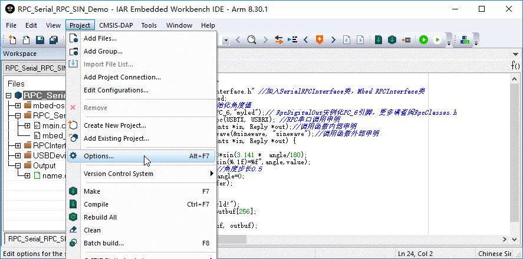 
通常，在General Options内的芯片在项目建立时已经选择好。
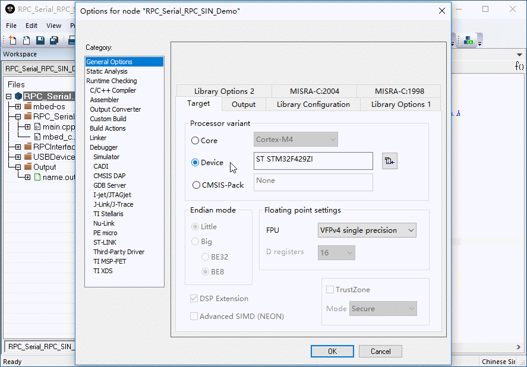 
在Debugger菜单内，Driver选择CMSIS DAP。下部的Device description file文件一定要选择对应的ddf文件，否则会出现连接失败。
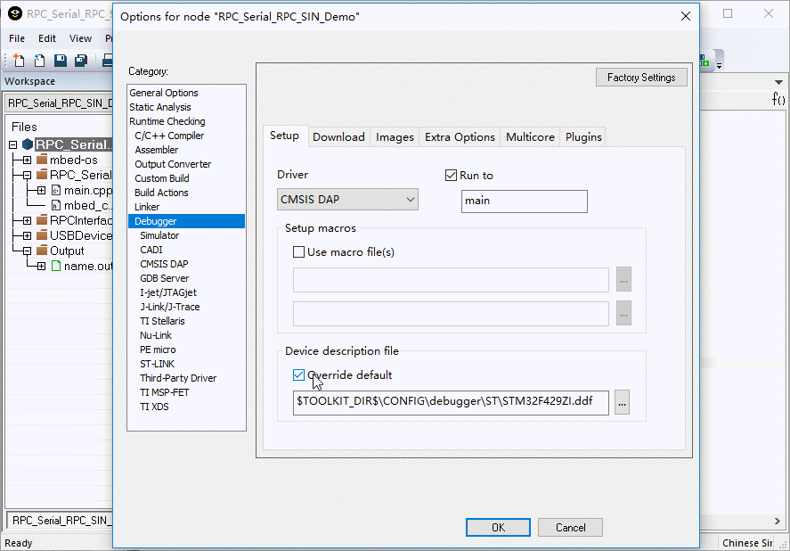 
在Debugger菜单的Download标签页内，.board file要选择正确，否则同样会提示错误。
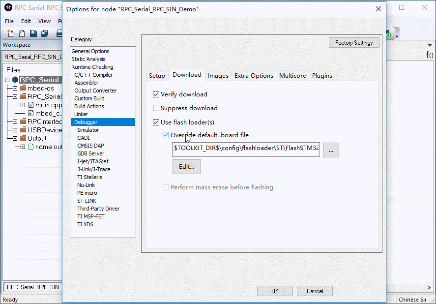 
在左侧CMSIS DAP菜单下的Interface标签页内，选择SWD接口，速度可以选择10MHz。
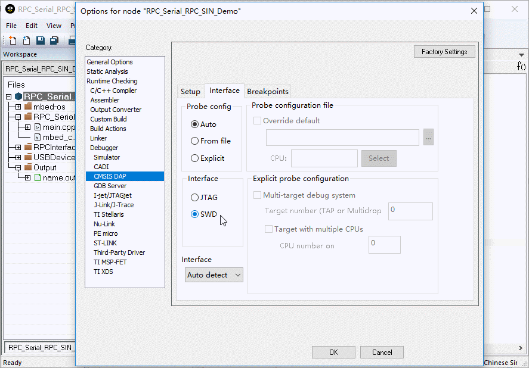 
配置完成后，在IAR菜单上显示了CMSIS-DAP，在这个菜单内可以进行FALSH操作。在菜单栏左边，点击绿色小箭头按钮，可以进行调试仿真。
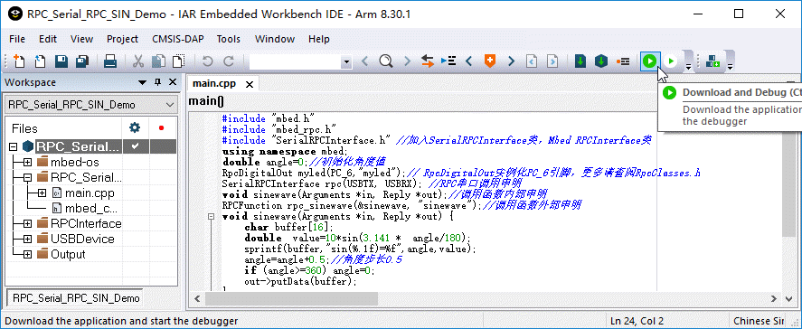
程序下载后进入调试模式，在菜单栏左边有对应调试按钮。
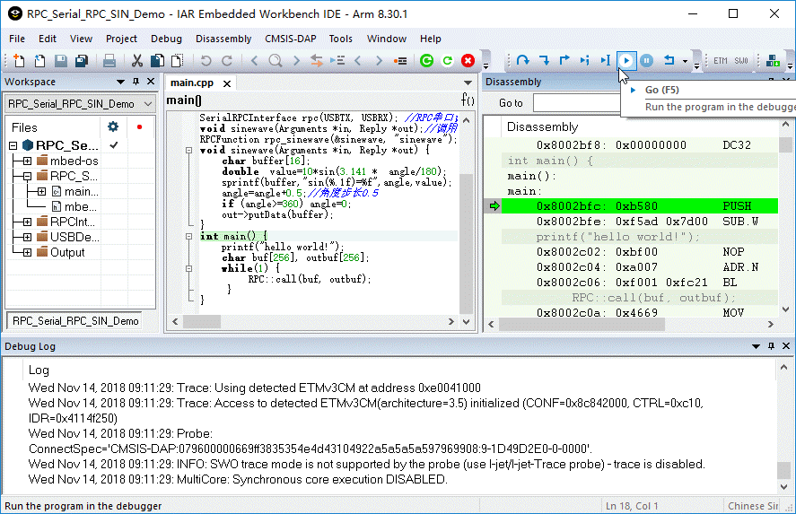
## Maintenance mode(引导加载程序模式下固件更新)
1. 按住复位键，将DAPLink接到电脑USB接口，电脑将出现MAINTENANCE可移动磁盘驱动器。
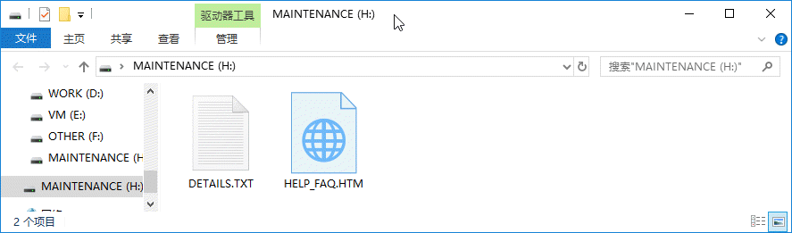
2. 将新固件复制到驱动器上。如果成功, 设备将离开引导加载程序模式, 并开始运行新的固件。否则, 引导加载程序将显示FAIL.TXT解释问题出在哪里。

更多DAPLink内容：https://github.com/maximlab/DAPLink 
