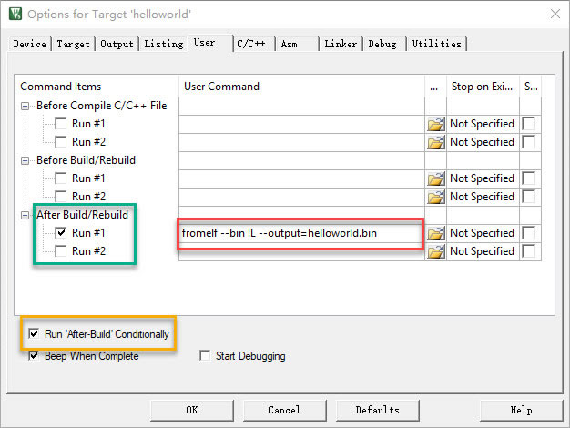

## Mbed CLI使用指南
Mbed OS的在线Mbed编译环境实现使用浏览器进行Mbed的云端开发。对于初学者而言这是十分方便的，免去了许多开发环境的安装和配置，而且能方便地实现软件更新和发布，分享。但是在线编译的缺点也十分明显，就是需要良好的网络环境，当网络不通畅时，体验非常糟糕。<br />
如果不使用在线编译，你可以有两个选择：<br />
### 在线IDE导出为第三方编译工具项目
在线编译环境中建立应用程序的代码，通过export导出成第三方编译工具的项目，比如keil uvision项目。浏览器将转换好的项目自动下载下来，然后解压，使用Keil工具编译。<br />
### 使用Mbed CLI命令行工具
Mbed CLI是Arm Mbed OS的命令行工具，它可以代码仓库版本控制、依赖管理、代码发布、从其他地方获取代码、调用编译系统及其他。Mbed CLI可以管理多项目，也就是多个项目可以分享同一个Mbed OS的源代码。如果你采用github代码仓库的话，你只需要上传应用程序的代码，而不需要上传几百兆的Mbed OS在github上，同样可以实现代码分享和版本控制。<br />我们在modular-2应用程序的开发过程中，采取将代码保存在github上，使用Mbed CLI实现程序编译的方法。
### Mbed CLI 安装
Windows安装比较简单，官网（https://os.mbed.com/docs/latest/tools/installation-and-setup.html) 直接下载安装。<br>下载链接http://mbed-os.s3-eu-west-1.amazonaws.com/builds/Mbed_installer_v0.4.7.exe <br><br>

### LINUX安装
需要先安装以下工具
+ Python - mbed CLI 是用Python写的，并且在 version 2.7.13 上做过完整测试，不兼容Python3.x
+ Git - version 1.9.5 or later
+ Mercurial - version 2.2.2 or later
+ GNU ARM - ARM GCC交叉编译工具
```
$ git clone https://github.com/ARMmbed/mbed-cli
$ python setup.py install
```
参考链接https://docs.mbed.com/docs/mbed-os-handbook/en/5.1/dev_tools/cli/ 
## Windows Mbed CLI运行 
WIN键+R键，cmd回车进入命令行，输入mbed运行，将显示Mbed CLI的常见参数。
```
C:\>mbed
usage: mbed [-h] [--version]             ...
Command-line code management tool for ARM mbed OS - http://www.mbed.com
version 1.7.2
Use 'mbed <command> -h|--help' for detailed help.
Online manual and guide available at https://github.com/ARMmbed/mbed-cli
optional arguments:
  -h, --help   show this help message and exit
  --version    print version number and exit
Commands:
    new        Create new mbed program or library
    import     Import program from URL
    add        Add library from URL
    remove     Remove library
    deploy     Find and add missing libraries
    publish    Publish program or library
    update     Update to branch, tag, revision or latest
    ......
```
mbed config –L检查配置
```
C:\>mbed config -L
[mbed] Global config:
GCC_ARM_PATH=C:\Program Files (x86)\GNU Tools ARM Embedded\6 2017-q2-update\bin

[mbed] Local config (C:\):
Couldn't find valid mbed program in C:\
```
如果没有配置下GCC的路径（你安装GNU ARM的路径），请按如下命令设置：
```
mbed config --global GCC_ARM_PATH "C:\Program Files （x86）\ GNU Tools ARM Embedded\6 2017-q2-update\bin"
```

## 快速例子
```
C:\>mbed import https://github.com/modular2/helloworld
[mbed] Importing program "helloworld" from "https://github.com/modular2/helloworld" at latest revision in the current branch
[mbed] Adding library "mbed-os" from "https://github.com/ARMmbed/mbed-os" at rev#949cb49ab0a1
[mbed] Auto-installing missing Python modules...
C:\cd helloworld
C:\helloworld>mbed compile -S//检查一下支持列表
[mbed] Auto-installing missing Python modules...
......
| NUCLEO_F413ZH         | Supported | Supported | Supported | Supported | Supported |     -     | Supported | Supported |
| NUCLEO_F429ZI         | Supported | Supported | Supported | Supported | Supported |     -     | Supported | Supported |
| NUCLEO_F439ZI         | Supported | Supported | Supported | Supported | Supported |     -     | Supported | Supported |
| NUCLEO_F446RE         | Supported | Supported | Supported | Supported | Supported |     -     | Supported | Supported |
| NUCLEO_F446ZE         | Supported | Supported | Supported | Supported | Supported |     -     | Supported | Supported |
| NUCLEO_F746ZG         | Supported | Supported | Supported | Supported | Supported |     -     | Supported | Supported |
......
Supported targets: 270
```
针对Modular-2进行编译时，开发板选择使用相同CPU的NUCLEO_F429ZI。
```
C:\helloworld>mbed compile -t GCC_ARM -m NUCLEO_F429ZI
[mbed] Auto-installing missing Python modules...
Building project helloworld (NUCLEO_F429ZI, GCC_ARM)
Scan: helloworld
Scan: env
Compile [  0.2%]: mbed_tz_context.c
Compile [  0.3%]: AnalogIn.cpp
Compile [  0.5%]: main.cpp
Compile [  0.7%]: BusIn.cpp
Compile [  0.8%]: BusInOut.cpp
Compile [  1.0%]: BusOut.cpp
Compile [  1.2%]: CAN.cpp
Compile [  1.3%]: Ethernet.cpp
Compile [  1.5%]: FlashIAP.cpp
Compile [  1.7%]: I2CSlave.cpp
Compile [  1.8%]: I2C.cpp
......
Link: helloworld
Elf2Bin: helloworld
| Module           |         .text |       .data |          .bss |
|------------------|---------------|-------------|---------------|
| [fill]           |     148(+148) |       3(+3) |       21(+21) |
| [lib]\c.a        | 25037(+25037) | 2472(+2472) |       89(+89) |
| [lib]\gcc.a      |   3168(+3168) |       0(+0) |         0(+0) |
| [lib]\misc       |     252(+252) |     16(+16) |       28(+28) |
| main.o           |       98(+98) |       4(+4) |       28(+28) |
| mbed-os\drivers  |     283(+283) |       4(+4) |     100(+100) |
| mbed-os\events   |   1611(+1611) |       0(+0) |   1576(+1576) |
| mbed-os\features |   2070(+2070) |       0(+0) | 12692(+12692) |
| mbed-os\hal      |   1685(+1685) |       4(+4) |       68(+68) |
| mbed-os\platform |   2843(+2843) |   260(+260) |     133(+133) |
| mbed-os\rtos     | 12404(+12404) |   168(+168) |   6073(+6073) |
| mbed-os\targets  | 10129(+10129) |       5(+5) |     680(+680) |
| Subtotals        | 59728(+59728) | 2936(+2936) | 21488(+21488) |
Total Static RAM memory (data + bss): 24424(+24424) bytes
Total Flash memory (text + data): 62664(+62664) bytes

Image: .\BUILD\NUCLEO_F429ZI\GCC_ARM\helloworld.bin
```
编译结束生成helloworld.bin文件。

## 联机烧录
1. 将modular-2设备通过USB(DAPLink接口)连接开发电脑。
2. 将生成的bin文件复制到modular-2生成的存储盘符中。
3. 按复位键启动嵌入式程序。

## 导出为其他IDE工具项目
如果你需要进一步进行调试工作，你可以将源文件导出为其他IDE工具的项目文件。Mbed CLI支持导出为Keil uVision, IAR Workbench, 使用GCC Arm编译器的Makefile，使用GCC Arm编译器的Eclipse项目。
例如导出为uVision，你可以如下操作。 
```
C:\helloworld>mbed export -i uvision -m NUCLEO_F429ZI
[mbed] Auto-installing missing Python modules...
Scan: helloworld
```
Mbed CLI直接在项目目录helloworld下生成helloworld.uvprojx与其他配置文件，你可以直接用Keil uVision打开。<br>
#### Keil uVision设置输出bin文件
打开项目后，在左侧项目结构中，右键项目名称进入[Options for Target 'helloworld']。在下图所示对话框中，勾选黄框、绿框中的选项，在红框内输入命令"fromelf --bin !L --output=helloworld.bin"（bin文件建议使用项目名称)，完成后按ok确认。<br><br>

<br>
点击上图蓝圈内的Rebuild，进行编译，最后在项目目录下生成helloworld.bin目标代码，其他操作参考联机烧录。
## 管理多个Mbed项目
Mbed CLI管理多个Mbed项目时，只需要在本地保留一套Mbed OS的源码，就可以让多个项目共享使用。
### 操作示例（目录位置可修改）
#### 建立一个projects 文件夹
```
C:\>mkdir projects
C:\>cd projects
```
#### 导入mbed-os，操作系统源码
```
C:\projects>mbed import mbed-os
[mbed] Importing program "mbed-os" from "https://github.com/ARMmbed/mbed-os" at latest revision in the current branch
[mbed] Auto-installing missing Python modules...
```
#### 配置projects/mbed-os为全局变量MBED-OS-DIR
```
C:\projects>mbed config -G MBED_OS_DIR C:\projects\mbed-os
[mbed] C:\projects\mbed-os now set as global MBED_OS_DIR
```
#### 建立项目project*
```
C:\projects>mbed new project1
[mbed] Creating new program "project1" (git)
[mbed] Auto-installing missing Python modules...

C:\projects>mbed new project2
[mbed] Creating new program "project2" (git)
[mbed] Auto-installing missing Python modules...
```
#### 添加应用程序的源码
以project1项目为例，向project1目录里面添加一个main.cpp ，例如：helloworld闪灯程序。
```
#include "mbed.h"
DigitalOut myled(PC_6);
int main() {
    printf("Hello The wolrd!\n");
    while(1) {
        myled = !myled; 
        wait(1.0); // 1 sec
    }
}
```
#### 编译代码
```
C:\projects>mbed compile -t GCC_ARM -m NUCLEO_F429ZI --source project1 --source mbed-os --build BUILD/project1
[mbed] WARNING: Could not find mbed program in current path "C:\projects".
[mbed] WARNING: You can fix this by calling "mbed new ." in the root of your program.
---
[mbed] Auto-installing missing Python modules...
Building project project1 (NUCLEO_F429ZI, GCC_ARM)
Scan: project1
Scan: mbed-os
Scan: env
Compile [  0.1%]: mbed_tz_context.c
Compile [  0.3%]: MCR20Drv.c
Compile [  0.4%]: at24mac.cpp
Compile [  0.5%]: NanostackRfPhyAtmel.cpp
......
Link: project1
Elf2Bin: project1
| Module             |         .text |       .data |          .bss |
|--------------------|---------------|-------------|---------------|
| [fill]             |     183(+183) |       3(+3) |       21(+21) |
| [lib]\c.a          | 25037(+25037) | 2472(+2472) |       89(+89) |
| [lib]\gcc.a        |   3168(+3168) |       0(+0) |         0(+0) |
| [lib]\misc         |     252(+252) |     16(+16) |       28(+28) |
| mbed-os\components |       32(+32) |       0(+0) |         0(+0) |
| mbed-os\drivers    |     261(+261) |       4(+4) |     100(+100) |
| mbed-os\events     |   1609(+1609) |       0(+0) |   1572(+1572) |
| mbed-os\features   |   2076(+2076) |       0(+0) | 12688(+12688) |
| mbed-os\hal        |   1839(+1839) |       4(+4) |       68(+68) |
| mbed-os\platform   |   2939(+2939) |   260(+260) |     133(+133) |
| mbed-os\rtos       | 12212(+12212) |   168(+168) |   6053(+6053) |
| mbed-os\targets    | 10271(+10271) |       5(+5) |     680(+680) |
| project1\main.o    |       98(+98) |       4(+4) |       28(+28) |
| Subtotals          | 59977(+59977) | 2936(+2936) | 21460(+21460) |
Total Static RAM memory (data + bss): 24396(+24396) bytes
Total Flash memory (text + data): 62913(+62913) bytes

Image: BUILD/project1\project1.bin
```
如果编译成功，在projects目录下就会出现一个BUILD文件夹和project1子文件夹，project1.bin就是目标代码，其他操作参考联机烧录。

## 注意事项
新建文件或项目目录名称不能有空格。 <br>
使用虚拟机时，VMware Workstation环境mbed import时，有python工具问题，建议使用Oracle VM VirtualBox环境。<br>
更多源码范例可以查看[项目汇总表](https://github.com/modular2/modular-2/blob/master/software/readme.md)<br>
更多Mbed CLI内容：https://github.com/ARMmbed/mbed-cli 
