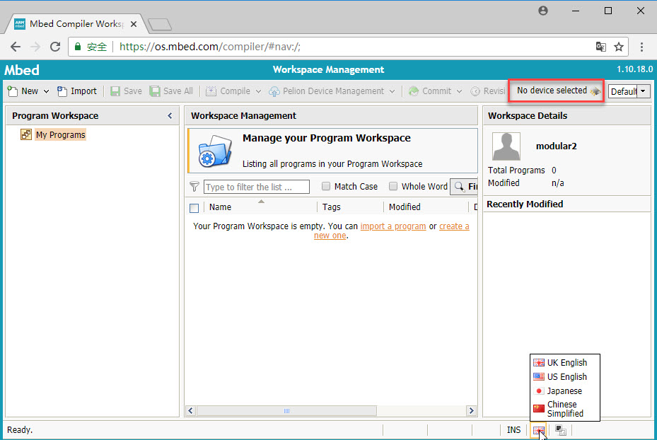
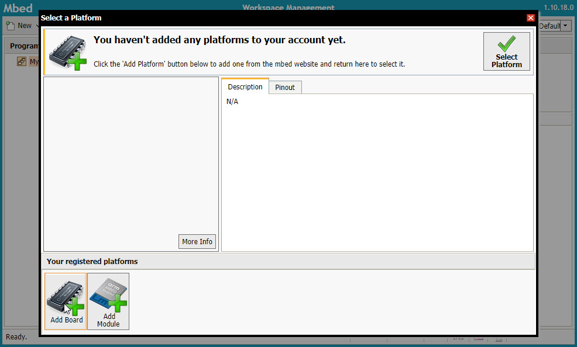
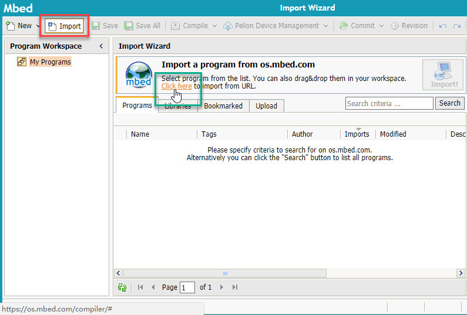
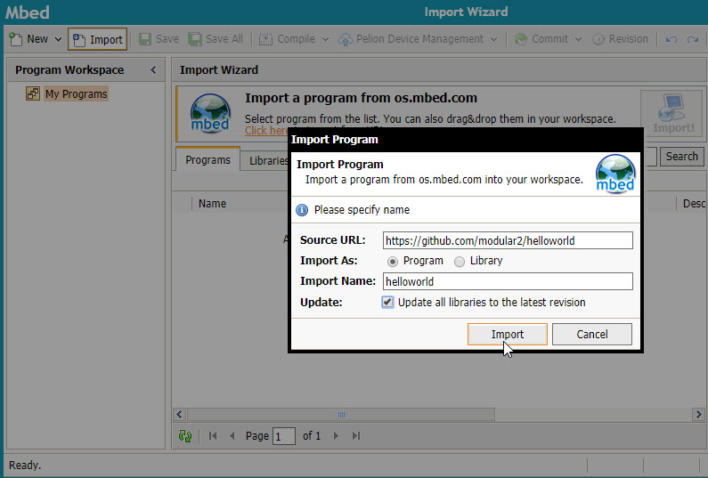
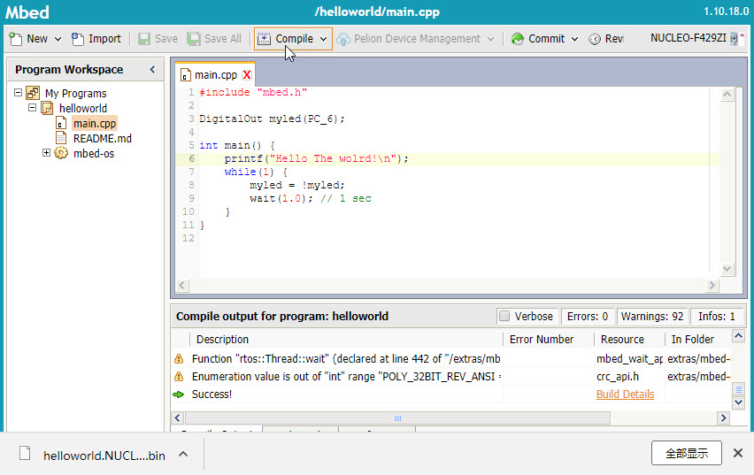
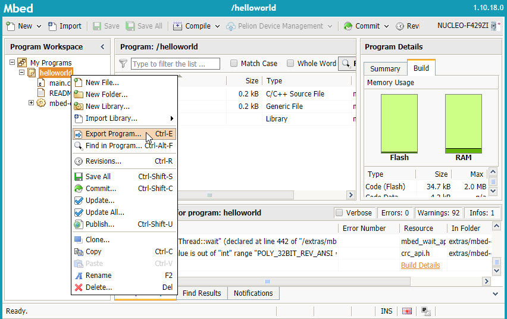

## Mbeb在线编译器使用指南
### 概述
Mbed官方为了用户开发方便，提供了网页版的开发工具，用户只要有联网的浏览器，就可以在所有的操作系统上进行Mbed的开发，包括windows，IOS,Anrdoid及Linux等。 
Mbed Compiler的主要功能如下：
+ 代码编辑，包括语法高亮显示，快捷键，撤消/重做，剪切/复制/粘贴，标签，块/行注释，代码格式化等；
+ 版本控制，包括代码提交，对比，回溯，分支和合并等功能；
+ 代码导入，支持用户导入各种Mbed库及应用程序用于修改开发；
+ 代码编译，在线工具默认使用ARM RVDS进行编译，用户可以支持查看编译后flash和ram的使用情况；

Mbed在线编译器对于初学者而言十分方便，免去了许多开发环境的安装和配置，并且能方便地实现软件更新和发布，分享。
### 开始
#### 申请Arm Mbed账号
前往[os.mbed.com](https://os.mbed.com/)，注册申请[Arm Mbed账号](https://os.mbed.com/account/signup/)。
#### 设置平台编译环境
前往[https://os.mbed.com/compiler](https://os.mbed.com/compiler)，使用注册账号登录。 如下图所示，可以在底部设置界面显示语言。在红框中，点击进入硬件平台添加界面。
 
 
如上图所示，首先点击Add Board进入[https://os.mbed.com/platforms/](https://os.mbed.com/platforms/)，进入使用相同CPU的NUCLEO_F429ZI详细页面。 
最后点击右侧[Add to your Mbed Compiler]，完成硬件平台的添加。 

### 第一个程序
 
如上图所示，在平台编译环境中，点击左上角红框中的[import]，点击显示页面里绿框中的[Click here]链接，弹出Import Program对话框，Source URL中输入[https://github.com/modular2/helloworld](https://github.com/modular2/helloworld)，其他如下图所示，点击Import导入。 
 
打开hellowolrd中的main.cpp，点击Compile，开始编译，编译成功后自动下载生成的bin文件。  

### 联机烧录
1. 将modular-2设备通过USB(DAPLink接口)连接开发电脑。
2. 将生成的bin文件复制到modular-2生成的存储盘符中。
3. 按复位键启动嵌入式程序。
### 导出为其他IDE工具项目
如果你需要进一步进行调试工作，你可以将源文件导出为其他IDE工具的项目文件。 
例如：需要导出为uVision时，可以在平台编译环境中，右键点击项目名称，点击弹出菜单中Export Program，在弹出的对话框中，选择Export Toolchain为uvision5-armc5后，点击Export导出，浏览器将自动下载项目zip包。具体可参考下图。 

## 其他事项
更多源码范例可以查看[项目汇总表](https://github.com/modular2/modular-2/blob/master/software/readme.md)  
更多Mbed在线编译器内容：https://os.mbed.com/docs/v5.10/tutorials/quick-start-online.html
